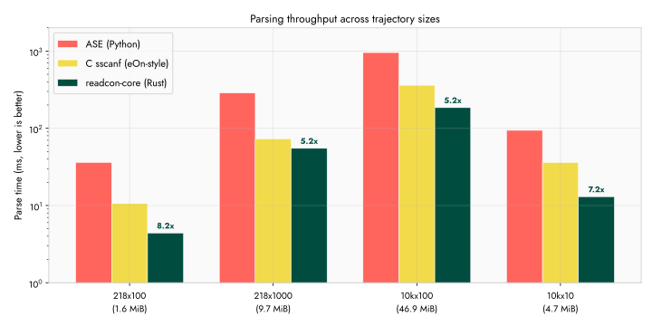
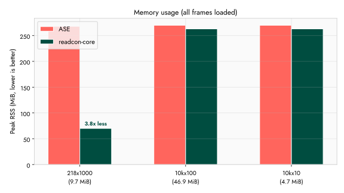
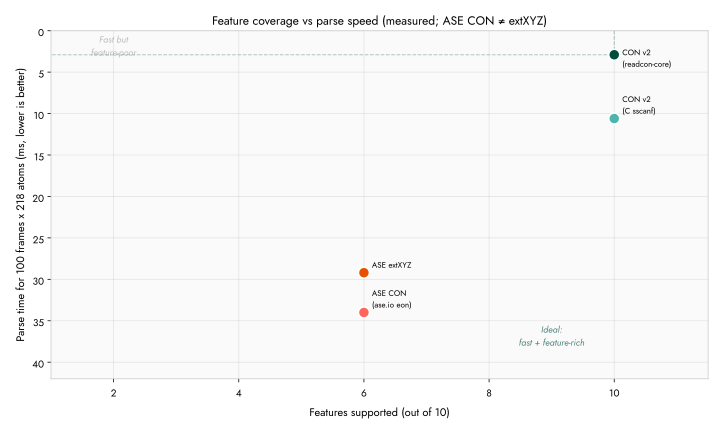

#+title: Performance Benchmarks
#+options: toc:nil num:nil ^:nil

* Methodology

Unless noted, historical tables below used [[https://bheisler.github.io/criterion.rs/book/][Criterion.rs]] with default settings (100 iterations,
5-second warm-up). Measurements taken on a single core. Times report
the median of the sample distribution. Source: =benches/iterator_bench.rs=.

Run benchmarks locally:

#+begin_src shell
cargo bench
# or: pixi r bench
#+end_src

* CI Cachegrind (always-on numbers)

Hand-written Criterion tables below can lag releases. For *regression tracking
on every =main= push*, CI runs Valgrind *Cachegrind* on
=examples/cachegrind_harness.rs= and commits instruction counts into the docs.

#+begin_export rst
.. include:: _generated/cachegrind_results.rst
#+end_export

Reproduce locally (needs Valgrind; several minutes):

#+begin_src shell
scripts/run_cachegrind_bench.sh
# outputs docs/source/_generated/cachegrind_results.{json,rst}
#+end_src

*Why Cachegrind instead of Criterion on CI?* Wall-clock medians on shared
GitHub runners are noisy (noisy neighbours, CPU migration). Cachegrind counts
*instruction references* for a fixed binary — stable enough to diff commits
and fail a PR workflow later if desired. Criterion remains best for local
latency intuition; PR workflow =Benchmark PR= still compares Criterion
baselines with =critcmp=.

*Chemfiles / format conversion* is not in this harness yet (optional feature,
links =libchemfiles=). Add scenarios only when conversion is on the critical
path you care to regress; CON I/O is the core library cost.

*Do the old tables need updating?* Yes for marketing-style µs claims after
hot-path changes (0.13 chemfiles is orthogonal to CON parse unless you
measure conversion). Prefer treating Criterion tables as *illustrative* and
Cachegrind as *authoritative for CI*. Re-run =cargo bench= +
=benches/make_plots.py= when preparing a paper or major release — Pareto plot uses
*measured* points only: =readcon= / ASE CON / ASE extXYZ from
=multiformat_traj_terra.json= (equal geometry, 100 frames × 218 atoms) plus C
sscanf from =compare_readers.py=; ASE CON is labeled as CON, not as extXYZ.
Conversion cost is in the Cachegrind table (``chemfiles_*`` scenarios).

* Frame parsing throughput

| Benchmark | Dataset | Time | Throughput |
|--------------------------+-----------+-----------+--------------------------|
| Single frame parse | 4 atoms | 1.5 us | 2.7M atoms/s |
| 2-frame parse (next) | 2x4 atoms | 2.3 us | 3.5M atoms/s |
| 2-frame skip (forward) | 2x4 atoms | 0.6 us | 13M atoms/s (skip mode) |
| 100-frame sequential | 100x4 atoms | 212 us | 1.9M atoms/s |
| 100-frame forward skip | 100x4 atoms | 29 us | 14M atoms/s (skip mode) |
| 218-atom frame (cuh2) | 218 atoms | 42 us | 5.2M atoms/s |

=forward()= skips frames by line counting without parsing atom data,
achieving 7x higher throughput than full parsing. This matters for
trajectory analysis that only needs specific frames (e.g., every 10th).

* Velocity parsing overhead

| Benchmark | Time | Overhead vs coords-only |
|---------------------+--------+-------------------------|
| Coords only (2x4) | 2.3 us | (baseline) |
| Coords + vel (2x4) | 3.9 us | +70% |
| Vel skip (forward) | 0.9 us | (skip mode) |

Velocity sections add roughly 70% parsing time (same line count, same
float parsing). The =forward()= skip mode handles velocity sections
with minimal overhead.

* Float parsing: fast-float2 vs stdlib

| Parser | 5-column line | Speedup |
|-----------------+---------------+---------|
| fast-float2 | 100 ns | 2.0x |
| str::parse::<f64> | 202 ns | 1.0x |

readcon-core uses [[https://github.com/aldanor/fast-float-rust][fast-float2]] for all coordinate, velocity, and force
line parsing. This provides a consistent 2x speedup over Rust's
standard library float parser on the hot path.

* I/O strategy: mmap vs read_to_string

| Strategy | 218-atom file (16 KiB) | Notes |
|-----------------+------------------------+--------------------------------------|
| read_to_string | 42 us | Slight edge for small files |
| mmap | 44 us | Fixed overhead (VMA, page fault) |

For files under 64 KiB, =read_to_string= avoids mmap overhead. For
larger trajectory files, mmap lets the OS page cache handle data
without a full heap copy. readcon-core switches automatically at the
64 KiB threshold.

Compressed files (=.con.gz=) always decompress to an in-memory buffer
regardless of size, since mmap cannot decompress on the fly.

* Cross-implementation comparison

** Efficiency notes (what the code does—not wall-clock “science”)

Ad-hoc wall-clock medians (N warmups, median of M runs, geomeans of ratios) are
**not scientific measurements**. They depend on load, CPU frequency, OS noise,
and the harness itself. JSON under =benches/results/*= from those harnesses is
historical engineering smoke-check output, not a result to cite as fact.
Prefer structural reasoning, Cachegrind/I_refs (where present above), and
=perf= samples when deciding *what* to change—and still treat those as
development tools, not publication-grade evidence.

**Public API (full frames only)**

- Load: =read_all_frames= / =ConFrameIterator= / Python =iter_con= /
  =read_first_frame= (always full =ConFrame= fidelity).
- Skip payload: =count_frames= / =forward_fast= when you do not need atoms.
- Coordinates on a *loaded* frame: SoA on =ConFrame= / Python =coords_array()=.
- No separate public “coords-only” trajectory load.

**Hot-path structure (shipped)**

- Multi-frame parse: mmap above 64 KiB; Rayon when file size ≥ 48 KiB
  (~parallel~ feature / Python wheels).
- Decimals: =fast_float2= (Eisel–Lemire class); atom lines use byte scan +
  =parse_partial= on =&[u8]=, not a hand-rolled digit SIMD parser.
- Newline skip: =memchr= (=forward_fast= / shared =MemchrLines= cursor for full
  parse and skip—no dual =str::Lines= view).
- Default f64 positions: flat =Vec= fill then one Arc wrap
  (=from_f64_row_major=); =con_frame_coords_only= for full-frame assembly
  (masses by type run-length fill, atom ids one-shot).
- Optional sections: =sync_arrays_from_atom_data= only when sections applied.
- Python: =Python::detach= around Rust multi-frame parse so the GIL does not
  block Rayon / other Python threads; =coords_array= is always a fresh view of
  live atoms (no shared stale cache).

**Profiling tools (optional, developer-facing)**

- =perf record -g -- … profile_train once= — sample-based cost centers (noisy;
  use to pick *what* to inspect, not to quote a figure).
- =benches/run_pgo_ab.sh= / =examples/profile_train= (=train= / =once= only) —
  LLVM PGO train/use for an opt-in tuned binary; no wall-clock median report;
  default =cargo build --release= does not apply PGO.
- Criterion (=cargo bench --bench iterator_bench=) — microbench relative costs
  of float helpers, not end-to-end science.

** Multi-format trajectory (CON vs XYZ-class peers)

Harness =benches/multiformat_traj.py= (equal geometry, multi-frame CON vs
ASE/MDA/chemfiles XYZ peers) and =benches/compare_readers.py= exist for
*engineering* relative ordering on a fixed host. They are not a formal
performance study. Do not promote “median of N” from those scripts as a
scientific claim. Binary MD formats (XTC/TRR/DCD) and multi-node FS are out of
scope. CON carries richer sections than lean XYZ; chemfiles is the toughest
ASCII peer in that harness.

Older illustrative table (single host, not a paper result):

| Reader | Time (ms) | vs ASE (that run) |
|----------------------------+-----------+-------------------|
| ASE (=ase.io.eon=) | 36.1 | 1.0× |
| C sscanf (eOn-style) | 10.6 | 3.4× |
| readcon-core (file path) | 4.4 | 8.2× |
| readcon-core (from string) | 4.1 | 8.7× |

#+CAPTION: Parsing throughput across trajectory sizes (log scale; illustrative)

Structural reasons the C/Rust path can beat ASE/=sscanf= *in principle*:
- *fast-float2*: tuned decimal kernel vs typical =sscanf= dispatch
- *Zero-copy iteration*: borrows lines from the input =&str=, no =fgets= buffer copies
- *Pre-allocated vectors*: atom count known from header before parsing
- *No stdio overhead*: entire file in memory (mmap or read_to_string) vs per-line =fgets=

For trajectory files with thousands of frames, the difference
compounds: readcon-core's =forward()= skip mode processes frames it
does not need at 14M atoms/s, while Python readers must parse every
line.

* Scaling with file size

Measured across four trajectory sizes. readcon-core and C times are
=read_con_string()= (pre-loaded) and internal best-of-N respectively.
ASE times include file I/O.

| Dataset | File size | C sscanf | ASE | readcon | vs ASE | vs C |
|------------------+-----------+----------+--------+---------+--------+------|
| 218 x 100 | 1.6 MiB | 10.6 ms | 36 ms | 4.4 ms | 8.2x | 2.4x |
| 218 x 1000 | 9.7 MiB | 73 ms | 286 ms | 55 ms | 5.2x | 1.3x |
| 10k x 100 | 46.9 MiB | 361 ms | 956 ms | 185 ms | 5.2x | 2.0x |
| 10k x 10 | 4.7 MiB | 36 ms | 94 ms | 13 ms | 7.2x | 2.8x |

readcon-core maintains 5-8x speedup over ASE across all sizes. The
advantage over C narrows on large files (I/O becomes a larger fraction
of total time), but readcon-core remains consistently faster due to
fast-float2 and zero-copy parsing.

* Memory usage

Peak resident set size when loading all frames into memory:

| Dataset | readcon peak RSS | ASE peak RSS |
|------------------+------------------+--------------|
| 218 x 1000 | 70 MiB | 268 MiB |
| 10k x 100 | 263 MiB | 270 MiB |
| 10k x 10 | 263 MiB | 270 MiB |

For the 218-atom trajectory, readcon-core uses 3.8x less memory than
ASE (70 vs 268 MiB). At 10k atoms, both converge because the atom
data dominates (readcon stores ~120 bytes/atom, ASE stores similar
plus numpy overhead).

#+CAPTION: Peak memory usage with all frames loaded

The C sscanf reader frees each frame immediately, so its peak RSS
stays under 16 MiB regardless of trajectory length. readcon-core can
achieve similar constant-memory usage via the iterator API:

#+begin_src rust
// Process frames one at a time (constant memory)
let iter = ConFrameIterator::new(&contents);
for result in iter {
    let frame = result?;
    // process frame, then drop
}
#+end_src

* Scaling considerations

The per-atom parsing cost is dominated by float conversion (5 columns
per atom line). With fast-float2, each atom line takes roughly 100 ns
to parse. For a 10,000-atom frame:

- Coordinates: ~1 ms
- Coordinates + velocities: ~1.7 ms
- Coordinates + velocities + forces: ~2.4 ms
- With gzip decompression overhead: +10-30% (depends on compression ratio)

For trajectory files with many frames, the =parallel= feature gate
enables rayon-based frame-level parallelism, scaling linearly with
core count for the parsing phase.

* Memory profile

readcon-core allocates:
- One =Arc<str>= per atom type (not per atom) for symbol storage
- One =Vec<AtomDatum>= per frame (pre-allocated from header counts)
- No intermediate string allocations for atom line parsing (fast-float2
  parses directly from the borrowed =&str= slice)

For a 10,000-atom frame with velocities and forces, the in-memory
footprint is approximately:
- 10,000 atoms x 120 bytes/atom (coords + vel + forces + metadata) = 1.2 MB
- Header overhead: negligible
- Total: ~1.2 MB per frame in memory

The iterator API processes one frame at a time, so multi-frame files
do not require loading the entire trajectory into memory.

* Feature coverage vs other formats

The CON v2 format covers features that typically require multiple
formats or lossy workarounds in other ecosystems. The comparison below
includes text-based and binary formats commonly used in computational
chemistry.

#+CAPTION: Feature matrix: CON v2 vs common atomic structure formats
[[file:img/feature_comparison.svg]]

CON v2 achieves full coverage (10/10) across: positions, velocities,
forces, unit cell, per-direction constraints, atom identity
(round-trip), structured metadata, compression, multi-frame support,
and streaming iteration. No other single format covers all ten.

The extxyz format comes closest (6/10 with partial metadata) but lacks
per-direction constraints, atom identity tracking, and a formal
specification. LAMMPS dump format supports many features but is
tightly coupled to the LAMMPS ecosystem.

#+CAPTION: Feature coverage vs parse speed (measured =readcon= / ASE CON / ASE extXYZ from multiformat harness; C sscanf from =compare_readers=; ASE CON is not plotted as extXYZ)

readcon-core occupies the Pareto-optimal corner: maximum feature
coverage at the fastest parse speed among the measured text formats
(CON via =readcon= vs ASE CON and ASE extXYZ on equal geometry). Binary
formats (DCD, TRR) trade features for raw throughput -- they lack
metadata, constraints, and human readability; they are not on this plot.

* Statistical analysis

The point estimates above characterize typical performance. For
publication-quality results with credible intervals, we use
[[https://github.com/HaoZeke/bayescomp][bayescomp]] -- a Bayesian hierarchical comparison framework that fits
Gamma-family models with random intercepts per test system. This
provides posterior distributions for speedup factors rather than
single numbers, accounting for system-to-system variation and
measurement noise.

The bayescomp analysis pipeline reads Criterion JSON output and
=compare_readers.py= timing data, fits the model via =brms= /
=cmdstanr=, and produces posterior predictive checks and effect size
summaries suitable for JOSS or SoftwareX publication.

* Reproducing these benchmarks

#+begin_src shell
# Cross-implementation speed comparison (ASE, C, readcon)
uv run --with matplotlib --with numpy --with ase python benches/compare_readers.py

# Generate publication plots
uv run --with matplotlib --with numpy python benches/make_plots.py

# Rust microbenchmarks (Criterion)
cargo bench
#+end_src
