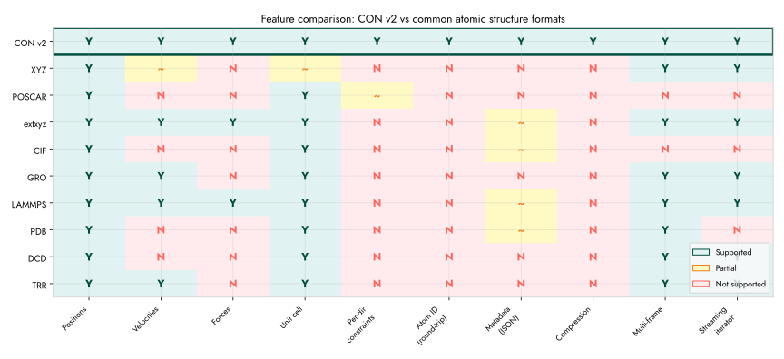

======================
Performance Benchmarks
======================

.. contents::

1 Methodology
-------------

All benchmarks use `Criterion.rs <https://bheisler.github.io/criterion.rs/book/>`_ with default settings (100 iterations,
5-second warm-up). Measurements taken on a single core. Times report
the median of the sample distribution. Source: ``benches/iterator_bench.rs``.

Run benchmarks locally:

.. code:: shell

    cargo bench
    # or: pixi r bench

2 Frame parsing throughput
--------------------------

.. table::

    +------------------------+-------------+--------+-------------------------+
    | Benchmark              | Dataset     | Time   | Throughput              |
    +========================+=============+========+=========================+
    | Single frame parse     | 4 atoms     | 1.5 us | 2.7M atoms/s            |
    +------------------------+-------------+--------+-------------------------+
    | 2-frame parse (next)   | 2x4 atoms   | 2.3 us | 3.5M atoms/s            |
    +------------------------+-------------+--------+-------------------------+
    | 2-frame skip (forward) | 2x4 atoms   | 0.6 us | 13M atoms/s (skip mode) |
    +------------------------+-------------+--------+-------------------------+
    | 100-frame sequential   | 100x4 atoms | 212 us | 1.9M atoms/s            |
    +------------------------+-------------+--------+-------------------------+
    | 100-frame forward skip | 100x4 atoms | 29 us  | 14M atoms/s (skip mode) |
    +------------------------+-------------+--------+-------------------------+
    | 218-atom frame (cuh2)  | 218 atoms   | 42 us  | 5.2M atoms/s            |
    +------------------------+-------------+--------+-------------------------+

``forward()`` skips frames by line counting without parsing atom data,
achieving 7x higher throughput than full parsing. This matters for
trajectory analysis that only needs specific frames (e.g., every 10th).

3 Velocity parsing overhead
---------------------------

.. table::

    +--------------------+--------+-------------------------+
    | Benchmark          | Time   | Overhead vs coords-only |
    +====================+========+=========================+
    | Coords only (2x4)  | 2.3 us | (baseline)              |
    +--------------------+--------+-------------------------+
    | Coords + vel (2x4) | 3.9 us | +70%                    |
    +--------------------+--------+-------------------------+
    | Vel skip (forward) | 0.9 us | (skip mode)             |
    +--------------------+--------+-------------------------+

Velocity sections add roughly 70% parsing time (same line count, same
float parsing). The ``forward()`` skip mode handles velocity sections
with minimal overhead.

4 Float parsing: fast-float2 vs stdlib
--------------------------------------

.. table::

    +-----------------------+---------------+---------+
    | Parser                | 5-column line | Speedup |
    +=======================+===============+=========+
    | fast-float2           | 100 ns        |    2.0x |
    +-----------------------+---------------+---------+
    | str\:\:parse\:\:<f64> | 202 ns        |    1.0x |
    +-----------------------+---------------+---------+

readcon-core uses `fast-float2 <https://github.com/aldanor/fast-float-rust>`_ for all coordinate, velocity, and force
line parsing. This provides a consistent 2x speedup over Rust's
standard library float parser on the hot path.

5 I/O strategy: mmap vs read\ :sub:`to`\ \ :sub:`string`\
---------------------------------------------------------

.. table::

    +-----------------------------------+------------------------+----------------------------------+
    | Strategy                          | 218-atom file (16 KiB) | Notes                            |
    +===================================+========================+==================================+
    | read\ :sub:`to`\ \ :sub:`string`\ | 42 us                  | Slight edge for small files      |
    +-----------------------------------+------------------------+----------------------------------+
    | mmap                              | 44 us                  | Fixed overhead (VMA, page fault) |
    +-----------------------------------+------------------------+----------------------------------+

For files under 64 KiB, ``read_to_string`` avoids mmap overhead. For
larger trajectory files, mmap lets the OS page cache handle data
without a full heap copy. readcon-core switches automatically at the
64 KiB threshold.

Compressed files (``.con.gz``) always decompress to an in-memory buffer
regardless of size, since mmap cannot decompress on the fly.

6 Cross-implementation comparison
---------------------------------

Measured with ``benches/compare_readers.py`` on a 100-frame trajectory
(218 atoms per frame, 1.6 MiB file). Median of 5 runs.

.. table::

    +----------------------------+-----------+-----------------+
    | Reader                     | Time (ms) |  Speedup vs ASE |
    +============================+===========+=================+
    | ASE (``ase.io.eon``)       |      36.1 | 1.0x (baseline) |
    +----------------------------+-----------+-----------------+
    | C sscanf (eOn-style)       |      10.6 |            3.4x |
    +----------------------------+-----------+-----------------+
    | readcon-core (file path)   |       4.4 |            8.2x |
    +----------------------------+-----------+-----------------+
    | readcon-core (from string) |       4.1 |            8.7x |
    +----------------------------+-----------+-----------------+

.. figure:: img/parsing_throughput.svg

    Parsing throughput across trajectory sizes (log scale)

readcon-core outperforms even a C sscanf-based reader (2.5x) because:

- **fast-float2**: SIMD-accelerated float parsing vs ``sscanf`` dispatch

- **Zero-copy iteration**: borrows lines from the input ``&str``, no ``fgets`` buffer copies

- **Pre-allocated vectors**: atom count known from header before parsing

- **No stdio overhead**: entire file in memory (mmap or read\ :sub:`to`\ \ :sub:`string`\) vs per-line ``fgets``

For trajectory files with thousands of frames, the difference
compounds: readcon-core's ``forward()`` skip mode processes frames it
does not need at 14M atoms/s, while Python readers must parse every
line.

7 Scaling with file size
------------------------

Measured across four trajectory sizes. readcon-core and C times are
``read_con_string()`` (pre-loaded) and internal best-of-N respectively.
ASE times include file I/O.

.. table::

    +------------+-----------+----------+--------+---------+--------+------+
    | Dataset    | File size | C sscanf | ASE    | readcon | vs ASE | vs C |
    +============+===========+==========+========+=========+========+======+
    | 218 x 100  | 1.6 MiB   | 10.6 ms  | 36 ms  | 4.4 ms  |   8.2x | 2.4x |
    +------------+-----------+----------+--------+---------+--------+------+
    | 218 x 1000 | 9.7 MiB   | 73 ms    | 286 ms | 55 ms   |   5.2x | 1.3x |
    +------------+-----------+----------+--------+---------+--------+------+
    | 10k x 100  | 46.9 MiB  | 361 ms   | 956 ms | 185 ms  |   5.2x | 2.0x |
    +------------+-----------+----------+--------+---------+--------+------+
    | 10k x 10   | 4.7 MiB   | 36 ms    | 94 ms  | 13 ms   |   7.2x | 2.8x |
    +------------+-----------+----------+--------+---------+--------+------+

readcon-core maintains 5-8x speedup over ASE across all sizes. The
advantage over C narrows on large files (I/O becomes a larger fraction
of total time), but readcon-core remains consistently faster due to
fast-float2 and zero-copy parsing.

8 Memory usage
--------------

Peak resident set size when loading all frames into memory:

.. table::

    +------------+------------------+--------------+
    | Dataset    | readcon peak RSS | ASE peak RSS |
    +============+==================+==============+
    | 218 x 1000 | 70 MiB           | 268 MiB      |
    +------------+------------------+--------------+
    | 10k x 100  | 263 MiB          | 270 MiB      |
    +------------+------------------+--------------+
    | 10k x 10   | 263 MiB          | 270 MiB      |
    +------------+------------------+--------------+

For the 218-atom trajectory, readcon-core uses 3.8x less memory than
ASE (70 vs 268 MiB). At 10k atoms, both converge because the atom
data dominates (readcon stores ~120 bytes/atom, ASE stores similar
plus numpy overhead).

.. figure:: img/memory_usage.svg

    Peak memory usage with all frames loaded

The C sscanf reader frees each frame immediately, so its peak RSS
stays under 16 MiB regardless of trajectory length. readcon-core can
achieve similar constant-memory usage via the iterator API:

.. code:: rust

    // Process frames one at a time (constant memory)
    let iter = ConFrameIterator::new(&contents);
    for result in iter {
        let frame = result?;
        // process frame, then drop
    }

9 Scaling considerations
------------------------

The per-atom parsing cost is dominated by float conversion (5 columns
per atom line). With fast-float2, each atom line takes roughly 100 ns
to parse. For a 10,000-atom frame:

- Coordinates: ~1 ms

- Coordinates + velocities: ~1.7 ms

- Coordinates + velocities + forces: ~2.4 ms

- With gzip decompression overhead: +10-30% (depends on compression ratio)

For trajectory files with many frames, the ``parallel`` feature gate
enables rayon-based frame-level parallelism, scaling linearly with
core count for the parsing phase.

10 Memory profile
-----------------

readcon-core allocates:

- One ``Arc<str>`` per atom type (not per atom) for symbol storage

- One ``Vec<AtomDatum>`` per frame (pre-allocated from header counts)

- No intermediate string allocations for atom line parsing (fast-float2
  parses directly from the borrowed ``&str`` slice)

For a 10,000-atom frame with velocities and forces, the in-memory
footprint is approximately:

- 10,000 atoms x 120 bytes/atom (coords + vel + forces + metadata) = 1.2 MB

- Header overhead: negligible

- Total: ~1.2 MB per frame in memory

The iterator API processes one frame at a time, so multi-frame files
do not require loading the entire trajectory into memory.

11 Feature coverage vs other formats
------------------------------------

The CON v2 format covers features that typically require multiple
formats or lossy workarounds in other ecosystems. The comparison below
includes text-based and binary formats commonly used in computational
chemistry.

    Feature matrix: CON v2 vs common atomic structure formats

CON v2 achieves full coverage (10/10) across: positions, velocities,
forces, unit cell, per-direction constraints, atom identity
(round-trip), structured metadata, compression, multi-frame support,
and streaming iteration. No other single format covers all ten.

The extxyz format comes closest (6/10 with partial metadata) but lacks
per-direction constraints, atom identity tracking, and a formal
specification. LAMMPS dump format supports many features but is
tightly coupled to the LAMMPS ecosystem.

.. figure:: img/pareto_features_vs_speed.svg

    Feature coverage vs parsing performance (Pareto front)

readcon-core occupies the Pareto-optimal corner: maximum feature
coverage at the fastest parse speed among text-based formats. Binary
formats (DCD, TRR) trade features for raw throughput -- they lack
metadata, constraints, and human readability.

12 Statistical analysis
-----------------------

The point estimates above characterize typical performance. For
publication-quality results with credible intervals, we use
`bayescomp <https://github.com/HaoZeke/bayescomp>`_ -- a Bayesian hierarchical comparison framework that fits
Gamma-family models with random intercepts per test system. This
provides posterior distributions for speedup factors rather than
single numbers, accounting for system-to-system variation and
measurement noise.

The bayescomp analysis pipeline reads Criterion JSON output and
``compare_readers.py`` timing data, fits the model via ``brms`` /
``cmdstanr``, and produces posterior predictive checks and effect size
summaries suitable for JOSS or SoftwareX publication.

13 Reproducing these benchmarks
-------------------------------

.. code:: shell

    # Cross-implementation speed comparison (ASE, C, readcon)
    uv run --with matplotlib --with numpy --with ase python benches/compare_readers.py

    # Generate publication plots
    uv run --with matplotlib --with numpy python benches/make_plots.py

    # Rust microbenchmarks (Criterion)
    cargo bench
